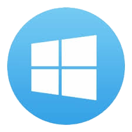
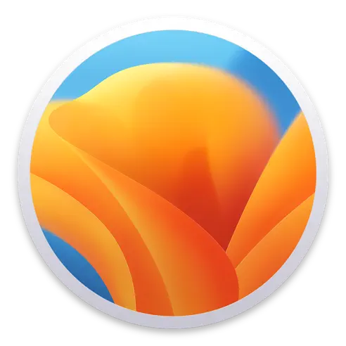
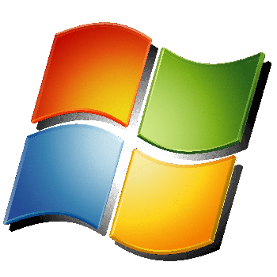
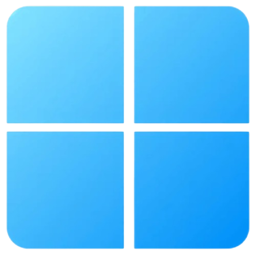

# Keyboard1000n17
Just a teen aspiring to be a web developer.  

## Skills:
 |  |  |  |  |  |  |
 | :---: | :---: | :---: | :---: | :---: | :---: |
 | HTML5| CSS3 | Basic JavaScript | Some Tauri | Some Linux | Academic performance | 

## Stats:

  

## Operating Systems used:

|  | &nbsp; |  |  |  |  |  |  |
| :--------------------------------------------------------------------------: | :----------------------------------------------------------------------------------------------------------------------------------------------------------------: | :------------------------------------------------------------------------: | :--------------------------------------------------------------------------: | :--------------------------------------------------------------------------: | :------------------------------------------------------------------: | :--------------------------------------------------------------------: | :------------------------------------------------------------------: |
|                                  Windows 10                                  |                                                                          macOS (tiny bit)                                                                          |                                 Windows 7                                  |                                  Windows XP                                  |                                  Windows 11                                  |                                Ubuntu                                |                                Pop!_OS                                |                                Fedora                                |

Yes, this is actually the order in which I used different operating systems.
